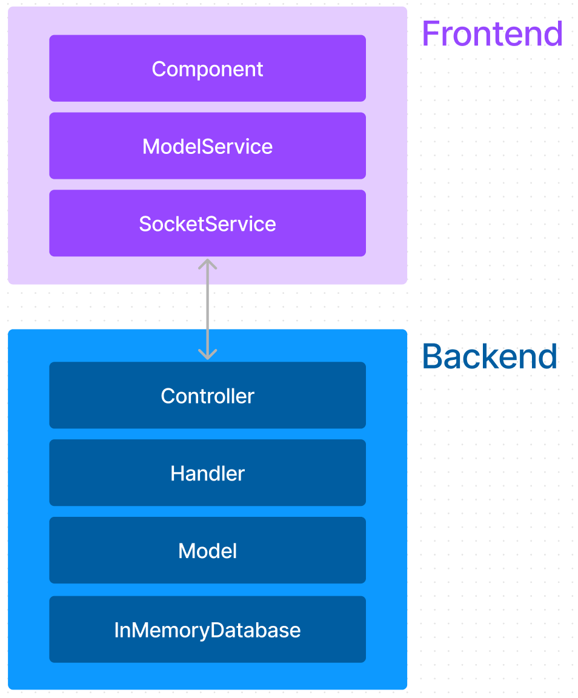
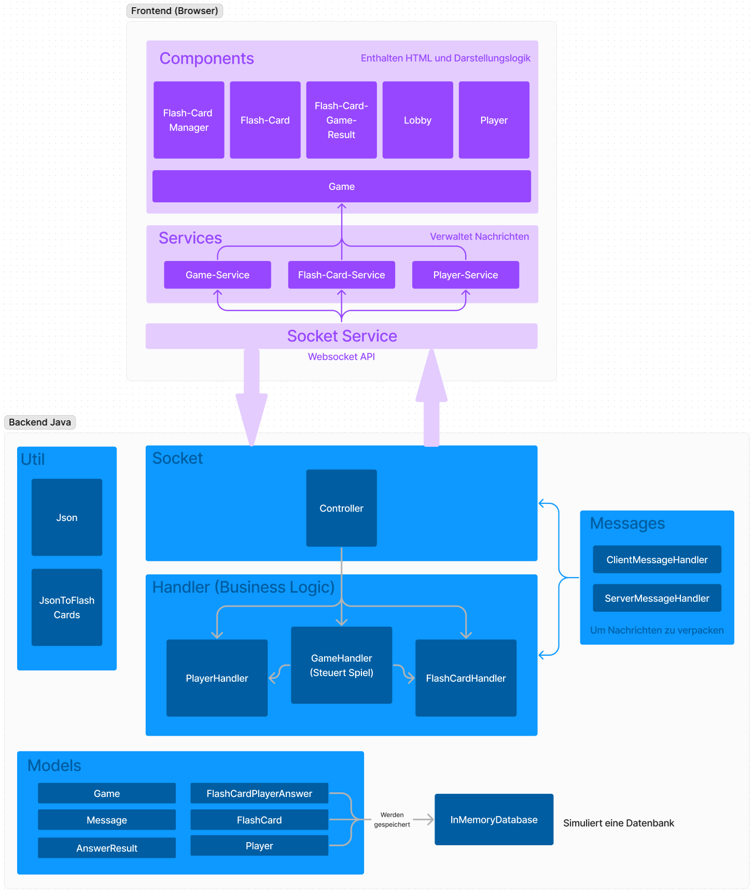
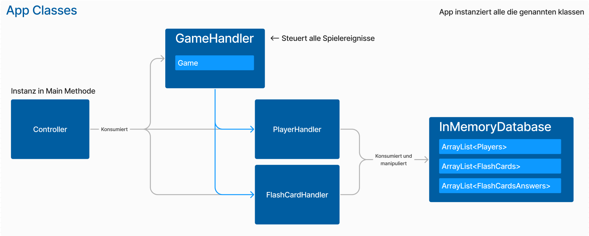
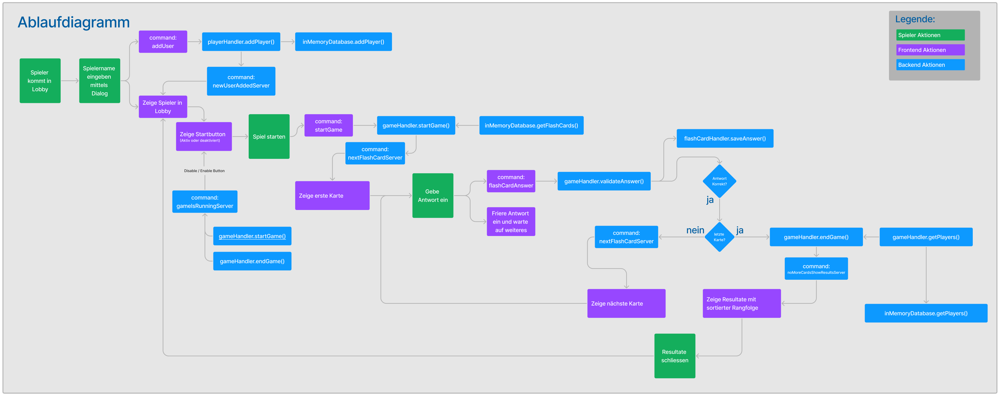

# JPL Multiplayer Quiz FS 2024 Gruppe J

_Autoren: Urs Angst, Denny Ovcar_

# Demo Video

---

# Inhaltsverzeichnis

- [1 Einführung und Ziele](#1-einführung-und-ziele)
- [2 Randbedingungen](#2-randbedingungen)
  - [2.1 Frontend](#21-frontend)
  - [2.2 Backend](#22-backend)
- [3 Struktur Überblick](#3-struktur-überblick)
  - [3.1 Architekturentscheidung](#31-architekturentscheidung)
  - [3.2 Applikation im Detail](#32-applikation-im-detail)
  - [3.3 Backend Hauptinstanzen in App.java](#33-backend-hauptinstanzen-in-appjava)
  - [3.4 Ablaufdiagram](#34-ablaufdiagram)
- [4 Erweiterungen entwickeln](#4-erweiterungen-entwickeln)

---

# 1 Einführung und Ziele

In diesem Projekt haben wir ein Multiplayer-Quiz-Spiel als Client-Server-Applikation implementiert.

Das Multiplayer-Quiz ermöglicht es mehreren Spielern, gleichzeitig an einem Quiz teilzunehmen, wobei jeder Spieler/Client Fragen erhält und Punkte sammelt, indem er die Fragen schnell und korrekt beantwortet. Die Implementierung erfolgt unter Verwendung von Java für das Backend und nativem JavaScript sowie Bootstrap für das Frontend.

Die Hauptziele dieses Projekts umfassen:

1. **Erlernen und Anwenden von Netzwerkprogrammierung:** Implementierung einer zuverlässigen Kommunikation zwischen Server und Clients mittels WebSockets.
2. **Effiziente Datenverarbeitung:** Nutzung von Bibliotheken wie Jackson zur Verarbeitung von JSON-Daten.
3. **Erstellung einer ansprechenden Benutzeroberfläche:** Einsatz von nativem JavaScript und Bootstrap, um eine intuitive und benutzerfreundliche UI zu gestalten.
4. **Teamarbeit und Projektmanagement:** Zusammenarbeit im Team, um ein komplexes Softwareprojekt erfolgreich zu planen, umzusetzen und zu dokumentieren.

# 2 Randbedingungen

## 2.1 Frontend

- **Technologien:** Natives JavaScript und Bootstrap wurden für die Benutzeroberfläche verwendet, um eine moderne und responsive UI zu gewährleisten.
- **Komponenten:** Die UI besteht aus verschiedenen Komponenten wie Flash-Card-Manager, Flash-Card-Game-Result, Lobby und Player. Jede Komponente hällt sein HTML und manipulliert dieses. Mit solchen Kapselungen bleibt das Projekt übersichtlich und wartbar.
- **Services:** Verwaltung der Nachrichten und Logik über Game-Service, Flash-Card-Service und Player-Service.
- **Socket Service:** Nutzung der WebSocket API für die Echtzeit-Kommunikation.

### Eingesetzte Technologien für Frontend

- Bootstrap für UI Komponenten

## 2.2 Backend

- **Model-Schicht:** Enthält die Datenmodelle wie Game, FlashCard, Player und AnswerResult, die in einer In-Memory-Datenbank gespeichert werden. Die Modelle halten nur Daten und bieten Getter und Setter Methoden.
- **Handler (Business Logic):** Umfasst die Hauptgeschäftslogik, darunter PlayerHandler, GameHandler und FlashCardHandler. Handler manipuliert die Model-Schicht.
- **Socket:** Verwaltet die Verbindung und Kommunikation zwischen Client und Server.
- **Controller:** Steuert den Ablauf und die Interaktion zwischen den verschiedenen Komponenten und Services.

### Eingesetzte Technologien für Backend

Für das Backend wurden folgende Libraries verwendet:

Um JSONs verarbeiten zu können:

- Jackson

  - Core
  - Databind
  - Annotations

Für WebSocket:

- Java-WebSocket-1.5.6.jar
  - slf4j-api-2.0.8.jar
  - slf4j-simple-2.0.8.jar

slf4j sind peer-dependencies von Java-Websockets.

---

# 3 Struktur Überblick

Die Applikationsstruktur ist in verschiedene Ebenen unterteilt, die in den folgenden Diagrammen detailliert dargestellt werden:

## 3.1 Architekturentscheidung

Trennung von Zuständigkeiten:

- **Model-Schicht:** Verantwortlich für die Datenhaltung. Modelle enthalten keine Geschäftslogik, sondern nur die Datenstrukturen und deren Getter- und Setter-Methoden. Diese klare Trennung stellt sicher, dass die Datenkapselung gewahrt bleibt und verhindert direkte Manipulationen der Daten.
- **Handler (Business Logic):** Alle Operationen und Geschäftslogiken werden über Handler abgewickelt. Dies fördert eine zentrale Kontrolle und Wartbarkeit der Applikation. Indem die Handler die einzige Instanz sind, die die Modelle manipulieren können, wird die Integrität und Konsistenz der Daten gewährleistet.
- **Controller:** Der Controller koordiniert die Interaktionen zwischen den verschiedenen Komponenten und Services, wodurch eine lose Kopplung und eine klar definierte Kommunikationsstruktur gefördert werden.

Dies fördert die Erweiterbarkeit der Applikation, da neue Funktionen oder Änderungen an bestehenden Komponenten einfach integriert werden können.

## 3.2 Applikation im Detail

## 3.3 Backend Hauptinstanzen in App.java

## 3.4 Ablaufdiagram

Das Ablaufdiagramm zeigt den gesamten Prozess des Spiels von der Anmeldung der Spieler bis zur Auswertung der Antworten und dem Ende des Spiels. Wichtige Schritte sind:

1. Spieler kommt in die Lobby und gibt seinen Namen ein.
2. Der Spieler wird zur Lobby hinzugefügt und erscheint in der Spielerliste.
3. Jeder kann das Spiel starten, insofern keines aktuell läuft. Sobald das Spiel startet, wird die erste Karte angezeigt.
4. Spieler geben ihre Antworten ein, und die Antworten werden validiert. Die nächste Karte wird erst angezeigt, wenn alle Spieler eine Antwort abgegeben haben.
5. Der Prozess wiederholt sich, bis alle Karten durchlaufen sind.
6. Am Ende des Spiels werden die Ergebnisse angezeigt.
7. Das Spiel kann erneut gestartet werden

_Möglicherweise nicht auf dem aktuellsten Stand_

---

# 4 Erweiterungen entwickeln

Beispielszenario für eine neue Funktion kann im Grunde wie folgt vorgegangen werden:

1. Einen passenden Comandonamen ausdenken für die Erweiterung
   - Client zu Server: [dein-neuer-kommandoname]
   - Server zu Client: [dein-neuer-kommandoname]Server
2. Bestehendes Datenmodell gegebenenfalls erweitern oder neues Modell erstellen.
3. Commando in Service und Controller einbauen
   - Frontend: Den neuen Commando in ein bestehenden Service einpflegen oder einen neuen erstellen.
   - Backend: Den Switch case mit dem Kommando erweitern. Gegebenenfalls Refactoring betreiben, wenn der Switchcase zu gross wird. Ähnlich wie in Frontend die Services sind aufteilen.
4. Entsprechende verarbeitung implementieren und mit dem Service / Controller verbinden
